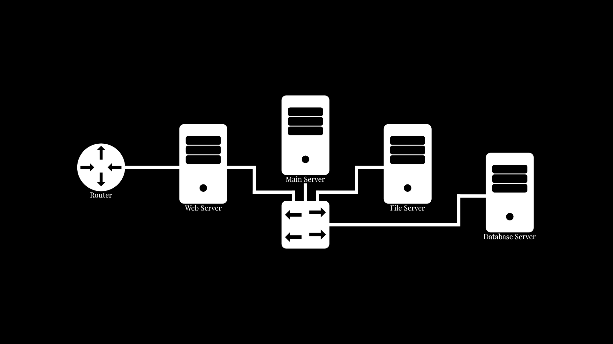

# ARWIN

This repository includes the code for all ARWIN servers.

- ARWIN Main Server
- ARWIN Web Server
- ARWIN File Server
- ARWIN Database Server

## How It Works
ARWIN functions in a star network like structure. As shown in the diagram below:

### ARWIN Main Server
The Main Server is the central server that handles all the other servers. It is responsible for:
- Processing incoming requests from other servers and sending them to the appropriate server.1
- Running security checks such as:
    - Checking incoming requests are secure.
    - Checking outgoing requests are secure.
    - Searching the servers themselves to ensure there are no security issues.
    - Various other security checks.
- Running maintenance tasks such as:
    - Fixing issues with the servers.
    - Updating the servers.
    - Checking the servers are running correctly.
    - Various other maintenance tasks.
- Various other administrative tasks.

### ARWIN Web Server
The Web Server is responsible for:
- Hosting my personal website.
- Hosting the ARWIN web interface.2
- Contacting the Internet.3

### ARWIN File Server
The File Server is responsible for:
- Storing the HTML, CSS and other Website files for the web server.
- Storing user files as part of the cloud storage system.
- Storing various other files.

### ARWIN Database Server
The Database Server is responsible for:
- Storing the user data.
- Storing the server data.
- Storing the server logs.
- Storing the server settings.
- Storing the server statistics.
- Storing various other data.

### Footnotes
1 All requests are sent to the Main Server for redirection, processing and review. This is so all requests can be successfully validated and made sure that they are legitimate and secure.

2 The Web Interface is hosted on [my personal website](https://tomcummings.me/ "Tom Cummings"). It can be found in the top right corner of the site.

3 The Web Server is the only server that has direct contact to the Internet. All servers must request Internet access through the web server in order to send a request. e.g. If the File Server wants to send a file to a client, it must send the file to the Web Server with the destination IP address attached. The web server will then send the file to the client.